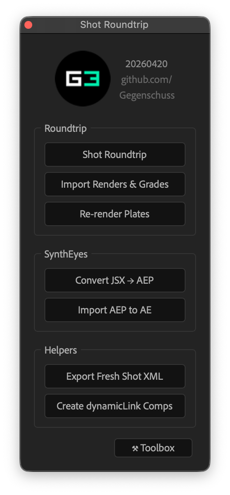
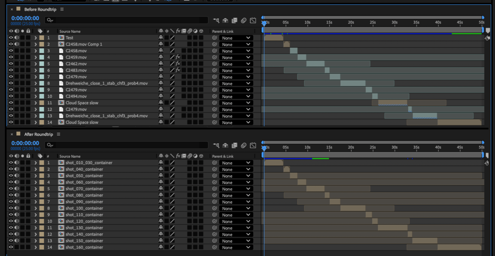
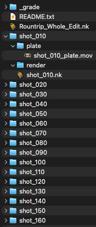
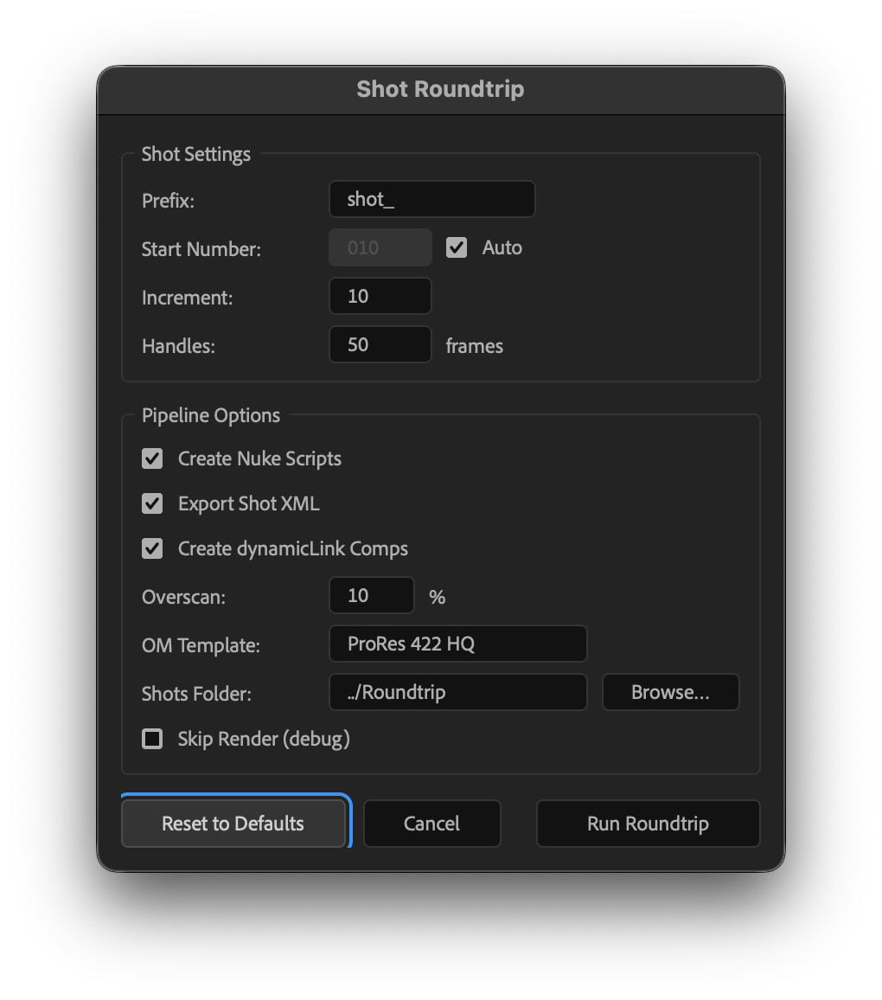
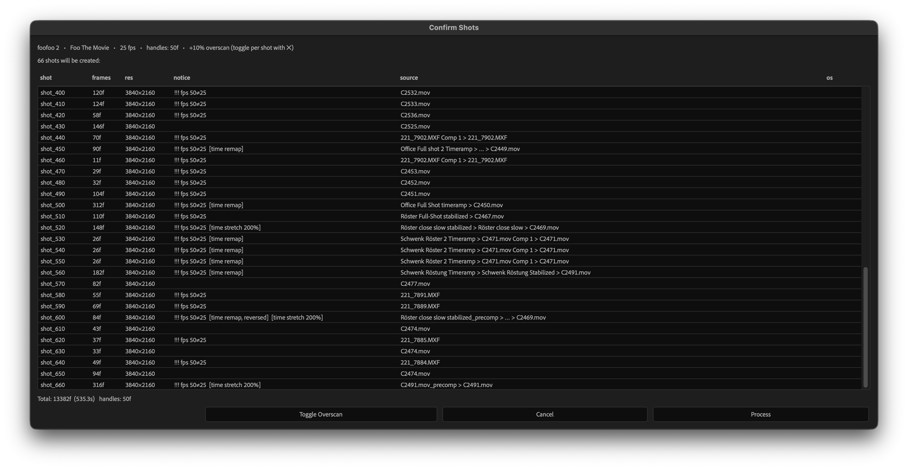
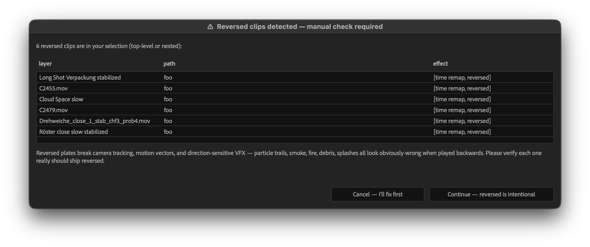
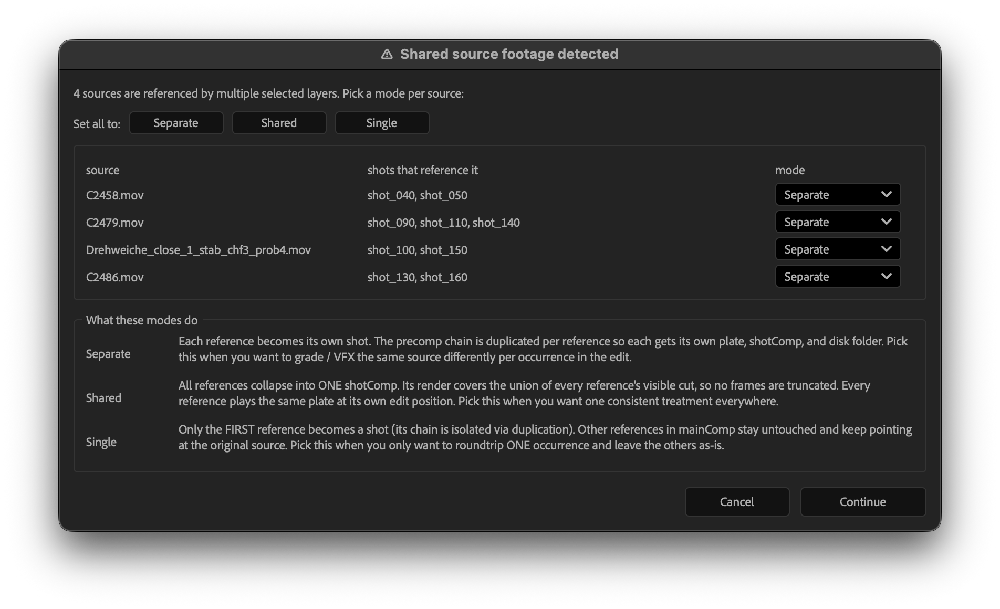
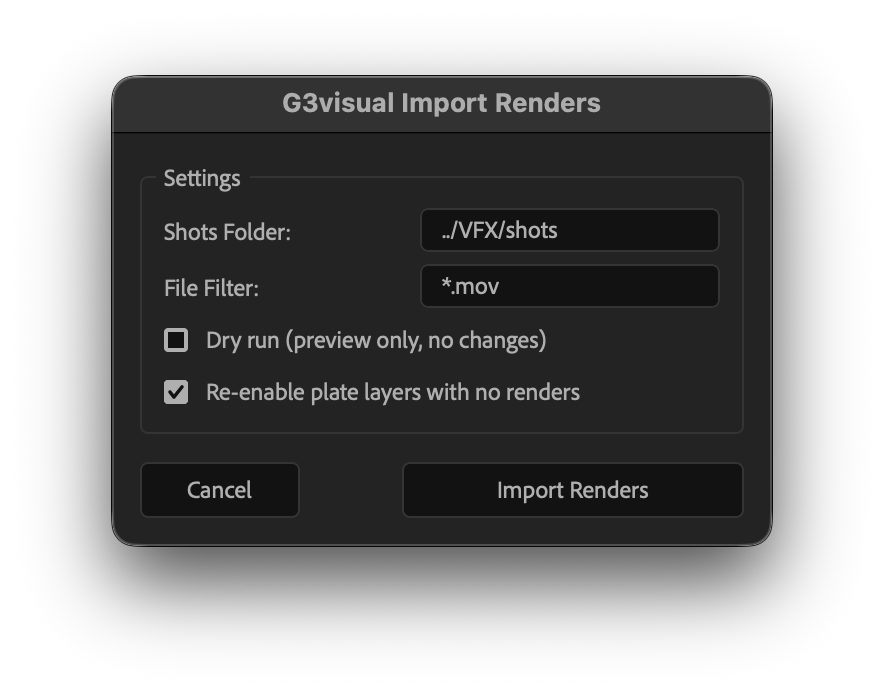

```
       _____                          __
      / ___/__ ___ ____ ___  ___ ____/ /  __ _____ ___
     / (_ / -_) _ `/ -_) _ \(_-</ __/ _ \/ // (_-<(_-<
     \___/\__/\_, /\__/_//_/___/\__/_//_/\_,_/___/___/
             /___/
```

# AE Shot Roundtrip

> A shot-roundtrip pipeline for After Effects — VFX, grading, edit
> reconstruction. By **Gegenschuss**.

Extract selected shots from an edit, render them out with handles, pull the
renders back into the original timeline, and ship standalone Dynamic Link
wrapper comps that can be reimported into Premiere as regular clips for edit
reconstruction.

All tools are accessible from a single dockable ScriptUI launcher panel.



> [!NOTE]
> **Shot Roundtrip version-bumps your `.aep` automatically before
> touching anything.** `MyProject_v03.aep` → `MyProject_v04.aep` (or
> `MyProject.aep` → `MyProject_v01.aep` if the file has no `_v##`
> suffix yet). Every modification lands in the new file; your original
> stays on disk untouched as the rollback point. If the Save As fails
> (disk full, permissions, etc.) the roundtrip aborts before any
> changes, so you can't lose work either way.

At [Gegenschuss](https://gegenschuss.com) we work heavily with
Adobe CC. Edits are cut in Premiere and move to After Effects once the edit
is close to locked — AE is still the tool of choice for motion-graphic-heavy
work, so there's no way around it. From there, individual shots often need to leave AE for
external tools — Nuke for compositing, SynthEyes for tracking, Houdini for
3D work — and doing that by hand for every shot is slow and error-prone.

Color grading was another pain point: once footage lives inside After
Effects, getting it into DaVinci Resolve for proper grading is awkward.
And you can't always just layer the AE comps back on top of the Premiere
edit, because stabilisation, time-remaps, and general compositing make the
AE output different from the original source.

The roundtrip workflow solves this by extracting every shot with clean
labelling and tidy project structure, so plates can travel to any external
app and come back without confusion. Handles are central to the whole
approach — our clients regularly request last-minute edit changes shortly
before delivery, so being able to return to Premiere via Dynamic Link comps
with extra frames on each side is a must. The FCPXML export covers the
Resolve side for color grading, and at the end we do the finishing back in
Premiere, because for our team that's the most straightforward way to bring
everything together.

## Requirements

- Adobe After Effects (tested on recent CC versions)
- Adobe Premiere Pro 25.4+ — **optional**, only needed if you want to use
  the companion "Trim Handles & Close Gaps" extension to reconstruct the
  edit from the generated Dynamic Link comps with handles
- macOS or Windows

## Installation

### Dockable panel (recommended)

1. Clone this repository somewhere stable.
2. Copy (or symlink) `GegenschussShotRoundtrip.jsx` into the ScriptUI Panels
   folder, **keeping the rest of the repo intact alongside it** — the panel
   loads sibling scripts by relative path, so every tool folder must stay
   next to the panel file.

   - **macOS**: `/Applications/Adobe After Effects <version>/Scripts/ScriptUI Panels/`
   - **Windows**: `C:\Program Files\Adobe\Adobe After Effects <version>\Support Files\Scripts\ScriptUI Panels\`

3. Restart After Effects. The panel appears under `Window > GegenschussShotRoundtrip.jsx`.
4. Allow scripts to write files:
   `Preferences > Scripting & Expressions > Allow Scripts to Write Files and Access Network`.

Symlinking the panel file from this repo into AE's ScriptUI Panels folder is
the cleanest setup — `git pull` updates stay live automatically.

### Quick run (no install)

`File > Scripts > Run Script File…` → pick `GegenschussShotRoundtrip.jsx`. The
panel opens as a floating window. Same constraint: every tool folder must
stay next to the panel.

## Workflow

Every tool in this panel is a step in the same round trip:

```
 Premiere ──→ After Effects ──→ plates with handles ──→ Nuke / SynthEyes / Houdini
                                                    ──→ DaVinci Resolve (via Shot XML)

 Premiere ←── Dynamic Link ←── After Effects ←──────── VFX renders + Resolve grades
    ↓                                                   imported back
 Trim Handles & Close Gaps → finishing in Premiere
```

1. **Edit in Premiere**, move to After Effects once the edit is close to locked.
2. Select layers in the edit comp, run **Shot Roundtrip**. Plates render out with handles, optionally creating Nuke scripts, Shot XML, and Dynamic Link comps.
3. **External work** — compositing in Nuke, tracking in SynthEyes, 3D in Houdini. Color grading in Resolve via the exported Shot XML.
4. Run **Import Returns** to pull finished VFX *and* Resolve-graded renders back into the AE shot comps. Grades stack above VFX, VFX above plate — so the topmost enabled layer is always the most finished version.
5. In Premiere, import the Dynamic Link comps and run **Trim Handles & Close Gaps** to reconstruct the edit.
6. **Finish in Premiere** — audio, titles, delivery. (Color is finalized upstream in Resolve; Premiere just carries the graded result through Dynamic Link.)

The handles are what make this work. Clients request last-minute edit changes before delivery, so every shot carries extra frames on each side. The Premiere extension trims them back to the editorial cut, and if the cut shifts, the frames are already there.



*Main comp before / after Shot Roundtrip — a mix of direct footage, retimed clips, and precomps collapses into a clean stack of `shot_NNN_container` layers, one per shot.*

### Editing the edit after AE has started

Clients will ask for new shots, dropped shots, or reordered shots after AE
work is underway. The pipeline is designed around this:

- **Shots are numbered in increments of 10** (`shot_010`, `shot_020`,
  `shot_030`, …) so new shots can be **sandwiched in** without renumbering:
  `shot_015` slots between `_010` and `_020`, `shot_012` between `_010` and
  `_015`, and so on. You get 9 free slots between any two adjacent shots.
  With **Auto** (default), the numbering is automatic: drop a new layer
  between two existing shots in the main comp, run the roundtrip, and the
  new shot picks the midpoint number on its own.
- **Dropped shots** stay numbered — just delete the comp and the folder on
  disk. Gaps in numbering are harmless.
- **Reordered shots** are rare; if editorial really shuffles the order,
  re-run Shot Roundtrip only on the new/moved layers. Never rename existing
  `_comp` comps to match a new order — the prefix+number is a stable ID,
  not a position.

## Tools

### Roundtrip

> [!WARNING]
> **Rules the entire workflow relies on — do not break these:**
>
> 1. **Use a unique shot prefix per project** (e.g. `KM_`, `NM_`, `TS_`)
>    and never change it after the first roundtrip run. The prefix ties
>    comps, disk folders, and Premiere clips together — renaming breaks the
>    chain.
> 2. **Shot numbers stay spaced by 10** (`{prefix}_010`, `{prefix}_020`,
>    …) so new shots can be inserted between existing ones without
>    renumbering. With **Auto** (default), the script picks numbers
>    automatically and sandwiches new layers between the existing
>    shots' time positions in mainComp — uncheck Auto to set Start
>    Number + Increment manually.
> 3. **Never rename `_comp` compositions.** Tools like `Import Returns`
>    and `Export Shot XML` derive the disk path from the comp name
>    (`{prefix}_010_comp` → `{shots}/{prefix}_010/`). Comps without the
>    `_comp` suffix are silently ignored.
> 4. **Never move the plate layer's in-point.** Shot Roundtrip locks the
>    raw plate at the bottom of `_comp`. Reimported variants stack in a
>    `{shot}_stack` precomp above it. Render imports and re-render passes
>    locate the raw plate by tag and align to its start time — shifting
>    it misaligns every VFX return.

- **Shot Roundtrip** — Core tool. For every selected layer (direct footage
  OR precomp) it extracts a `{prefix}_NNN_comp` render target with
  configurable shot prefix, starting number, increment (default `10`),
  handles, and optional overscan. It builds the render queue, renders the
  plates, imports the results back into the correct shots, and — as a final
  phase — walks the original selection and builds a `<source>_dynamicLink`
  wrapper comp per layer for Premiere reconstruction.

  Per-shot bins live under `/Shots/{prefix}_NNN/`. Multi-footage precomp
  containers get their own range bin `/Shots/{prefix}_FIRST_LAST/`, and
  wrapper precomps deeper in the chain are renamed `{shotName}_inner`
  (innermost), `{shotName}_inner2`, `{shotName}_inner3`, … — so the
  project panel reads shot-by-shot instead of keeping AE's auto-generated
  `"X.mov Comp 1"` names. All Dynamic Link wrappers land in
  `/Shots/dynamicLink/`.

  On disk, the `Roundtrip/` folder mirrors the project-panel layout: one
  folder per shot containing `plate/`, `render/`, plus the per-shot
  `.nk` Nuke script alongside an AppendClip master at the root.

  


  **Auto shot numbering** (default: on). Ticking the **Auto** checkbox
  next to Start Number makes the roundtrip pick each shot's number from
  its position in the main comp: new shots sandwich in between existing
  ones automatically. If you have `shot_010`, `shot_030`, `shot_040` and
  drop a new layer between `_030` and `_040`, the next run assigns
  `shot_035` without you doing any math. Uncheck Auto to revert to the
  old `start + N × increment` behavior for explicit control.

  **Multi-use sources.** A single selected precomp that cuts the same
  clip multiple times (e.g. three trims of `C2458.mov` inside one
  precomp) produces three separate shots, each rendering just its own
  cut. Cross-selection dedup still applies: two different selected
  precomps that share an inner footage file resolve to a single shared
  shotComp. Only the visible portion of each layer is rendered, even
  when the footage is buried several precomps deep — a 2-second cut of
  a 2-minute clip only renders 2 seconds (+ handles).

  

  After confirming settings, a shot list lets you review all layers,
  toggle overscan per shot, and verify source chains before processing:

  

  **Time-remap / reversal preflight.** Before building anything, the
  roundtrip recursively scans each selected layer and every precomp
  beneath it for time effects. It splits them into two categories:

  - **Reversed clips** (negative stretch, or time remap whose value
    decreases from in to out — at any depth) trigger a warning
    dialog listing every one in the selection (top-level or nested)
    so you can verify reversal is really what you want. Reversed
    plates break camera tracking, motion vectors, and
    direction-sensitive VFX — particle trails, smoke, fire, debris,
    splashes — so they almost never actually ship reversed. The
    dialog is an editorial sanity check, not a technical block: if
    the reversal is intentional, hit **Continue** and the roundtrip
    proceeds.

    


    Before anything else, negative-stretch reversals are rewritten
    into their time-remap equivalent (stretch → `100`, time-remap
    keyframes that reproduce the reversed playback). Same visual
    result, but the pipeline handles the remap form correctly
    end-to-end. A difference-key comparison against the original
    reversed layer may show a minor sub-frame shift at cut
    boundaries — negligible in normal viewing, but worth knowing
    if you're diff-matting converted vs. original. The
    [Reverse Stretch → Remap](#helpers) helper exposes the same
    conversion as a standalone button so you can preview or debug
    it on one layer at a time.

    **Bake** (default ON, per-row checkbox in the warning dialog).
    For each reversed clip ticked Bake, after the main render
    finishes the roundtrip wraps the shot's `_stack` precomp and
    renders it back out as a forward-playing reversed plate
    `{shot}_reversed.mov` into `{Roundtrip}/_baked/`. The baked
    file is added to `_stack` as a top-layer variant (blue label).
    The original mainComp layer's time-remap keys are mirrored
    descending → ascending so the edit plays the cut **forward**
    — pixel-matching the auto-rendered plate. The bake variant
    in `_stack` is the explicit reverse, ready for difference-key
    A/B against the natural plate or for use as the active plate
    via Select Version. Bottom row of the dialog has
    `Toggle Bake` / `Select All` / `Deselect All` for bulk
    flipping; the Continue button updates live to "Continue: N
    bake, M convert" so you see the split before you commit.

    **Color Time-Reverse Layers** (button in the Settings dialog).
    Walks the active comp's top-level layers in one undo step:
    paints layers with negative stretch or descending time-remap
    blue, everything else sandstone. Quick visual triage so you
    can see at a glance which clips will trip the reversal warning
    before you Run. The detection uses the same algorithm as the
    warning scan, so what gets blued here is exactly what the
    dialog will flag.

  - **Non-reversed time effects** (forward ramps, non-negative
    stretches) proceed silently. Top-level ones get auto-precomposed
    (see [Precompose Trimmed](#helpers)) so the plate renders forward
    at 100%. Nested ones are just left as-is — the artist gets the
    ramped plate, which is usually the editorial intent. They're
    listed passively as tags next to each shot in the Confirm Shots
    dialog, so you can eyeball them but aren't forced to act.

  Disabled, guide, null, adjustment, text, and shape layers are
  ignored by the scan — they can't contribute reversed pixels to the
  plate.

  **Shared source preflight.** When two or more selected layers
  reference the same inner footage (the same `.mov` file, possibly
  buried inside different precomps), the roundtrip pops a dedicated
  preflight dialog before Confirm Shots. It lists each shared source
  with the shot numbers that reference it and a per-row dropdown to
  pick how the roundtrip should handle that source:

  


  - **Separate** — chain is duplicated per reference; each becomes
    its own shot with its own plate, shotComp, and disk folder. Pick
    this when you want to grade / VFX the same clip differently per
    occurrence in the edit.
  - **Shared** — references collapse into ONE shotComp whose render
    covers the union of every reference's visible cut. All references
    play the same plate at their own edit positions, no frames
    truncated. The shared inner precomp is renamed `shot_NN_shared`
    so other references that still point at it read shot-aware. Pick
    this when you want one consistent treatment everywhere.
  - **Single** — only the FIRST reference becomes a shot (its chain
    is isolated via duplication); other references stay untouched and
    keep pointing at the original source. Pick this when you only
    want to roundtrip one occurrence and leave the others as-is
    (preview / temp / iterative).

  Bulk **Set all to** buttons let you flip every dropdown at once.
  Per-source picks persist across runs by source name — re-opening
  the dialog (after Cancel or after another roundtrip on the same
  project) restores your previous choices, and a global default
  (most-recently-used mode) seeds any new sources you haven't picked
  before. Cancelling here leaves the project pristine, same as
  cancelling at Confirm Shots.

- **Import Returns** — Scans all `*_comp` compositions in the
  project and imports finished returns from two sources:

  1. **VFX renders** — each shot's own `{shots}/{shot}/render/` folder.
  2. **Resolve grades** — a flat `{shots}/_grade/` folder shared across
     all shots, with files matched to comps by filename prefix
     (`KM_010_grade_v01.mov` → comp `KM_010_comp`).

  Layers stack in the comp:

  ```
  Top → grade   (from _grade/, matched by filename prefix)
        render  (from {shot}/render/)
        plate   (enabled state is never touched — you manage it)
  ```

  Within each category, the newest file wins (older versions are imported
  but disabled). The category order is fixed — a VFX re-render after a
  grade won't cover the grade, and a new grade always ends up on top.
  Already-imported files are skipped. The `_grade/` folder is optional;
  if it doesn't exist yet, only VFX renders are imported.

  Plate enabled/disabled state is intentionally left alone so you can
  verify the import is correct before hiding the source. Processed plate
  variants (a stabilized or denoised `_plate` rendered alongside the
  original) count as plates too — renders and grades stack above the
  topmost plate-like layer, never between two plate variants.

  **Why `_grade/` is flat, not per-shot:** per-shot folders (`plate/`,
  `render/`) travel with a shot when it's handed to another artist. Grades
  don't belong in that handoff, so they live in a separate flat archive
  at the shots root. Handed-off shot folders stay clean.

  **Stack precomp layout:** Shot Roundtrip locks the raw plate at the
  bottom of `_comp` and leaves it flat. It also creates a `{shot}_stack`
  precomp as a layer at the TOP of `_comp` (above the locked raw plate),
  sized to clip + handles with the source-TC offset on `displayStartTime`.
  All reimported variants live inside that precomp — grades on top, VFX
  renders in the middle, plate variants at the bottom — with only the
  topmost enabled per category. The raw plate itself is never moved into
  the precomp.

  Every `_stack` also gets the original forward source dropped in as a
  **guide layer** (brown label, sits just above the warning Null at the
  bottom). Guide layers don't render, so it's purely a visual reference
  for difference-keying against any variant in the stack. Audio is
  auto-muted on every layer except the topmost audio-bearing one, so
  re-imports don't pile up duplicate audio. The "Managed by
  Gegenschuss…" Null is always re-anchored as the bottommost layer
  after every variant addition.

  

- **Re-render Plates** — Re-renders selected shots' original plates to a
  new filename, ready to be handed to an external tool (Neat Video, a
  stabilizer, Mocha, …) and brought back in. Outputs land next to the
  plate so they travel with the shot on handoff:

  ```
  {shots}/{shot}/plate/{shot}_{suffix}.mov
  {shots}/{shot}/plate/{shot}_{suffix}_OS.mov    (overscan variant)
  ```

  Dialog asks for a suffix (default `denoised`), the shots folder, and
  the output-module template. It then:

  1. Scans every `*_comp` for its raw plate layer (the locked footage
     layer at the bottom, tagged `_plate.` or sitting under a `/plate/`
     folder). Shots with no plate layer are warn-and-skipped.
  2. Shows a **Confirm Shots** preflight listing each candidate
     (shot / plate source / frames / output filename). All rows are
     checked by default — select rows and press Space (or `Toggle
     Selected`) to opt any out. Cancel here aborts cleanly with zero
     project mutations.
  3. Temporarily disables every layer in `_comp` except the raw plate
     (guide layers are auto-excluded from render already), so the output
     is the pristine plate — never a previously imported grade, render,
     or plate variant. Enabled states are restored in a `try/finally`.
  4. Queues each `_comp` for render over its workArea (the clip +
     handles span set by Shot Roundtrip), so `{shot}_{suffix}.mov` has
     exactly the frames external tools need.
  5. After render, imports each rendered file back into the
     `{shot}_stack` precomp (above any existing plate-like layers). The
     new variant becomes the active plate for future re-renders /
     imports without disturbing the rest of the stack.

  **External roundtrip:** take `{shot}_{suffix}.mov` into your external
  tool, process it, and **overwrite the file in place** (keep the same
  filename). Back in AE, select the imported footage item and
  `File → Reload Footage` — the processed pixels appear instantly in
  every `_stack` precomp that references it, and the VFX + grade stack
  above keeps working as-is.

  The script version-bumps the `.aep` on Confirm (after the preflight,
  before any DOM mutation) so cancelling the dialog leaves no copy
  behind and the original file stays on disk as a rollback point once
  a render starts. Re-runs always re-render the ORIGINAL plate, never
  the variant — so running it twice gives you a fresh raw plate, not a
  copy of last pass's output.

- **Export Shot XML** — Exports an FCPXML 1.8 timeline of all `*_comp`
  compositions for import into DaVinci Resolve. For each comp, the active
  footage layer is picked to match whichever layout Import Returns
  has written:

  - If `_comp` contains a `{shot}_stack` precomp (the current layout), the
    export recurses into it and uses the topmost enabled footage layer
    there — naturally the newest grade if present, else the newest VFX
    render, else the plate.
  - Otherwise (flat legacy layout), the export uses the topmost enabled
    footage layer in `_comp` whose name starts with the shot number
    (e.g. the topmost layer starting with `KM_010` in comp `KM_010_comp`).

  Works for movie files and image sequences (MOV, MP4, DPX, EXR, …).

  **Resolve delivery setup for graded returns:**

  In Resolve's Deliver page, set:

  | Setting | Value |
  |---|---|
  | Render | Individual clips |
  | Format | QuickTime (match your VFX render codec, e.g. ProRes 422 HQ) |
  | Resolution | Same as source |
  | File destination | `{project}/Roundtrip/_grade/` |
  | Filename uses | Custom |
  | Custom pattern | `%Source Name_grade_v01` |

  Result: files like `KM_010_comp_v03_grade_v01.mov` — compound filename
  carrying both the VFX version (`_comp_v03`) and the grade iteration
  (`_grade_v01`). Before every new delivery pass, bump `_v01` → `_v02` in
  the preset — never overwrite, so older looks stay recoverable.

  Import Returns picks these up automatically; the shot-prefix
  matcher works on compound names at the first non-alphanumeric boundary.

### Project

Project-level pipeline tools that operate on the whole project or active
comp (vs. the layer-scoped Roundtrip tools above). Live in the panel's
**Project** group.

- **Export Shot XML** — described above under the Roundtrip section.
  Lives in the Project group — same script, two modes (Shots folder
  full-roundtrip export, or Active composition for the Comp Grade
  Roundtrip).
- **Import Comp Grades** — The import half of the **Comp Grade
  Roundtrip**. Pair to Export Shot XML's "Active composition" mode.
  For each footage layer in the active comp, finds a matching graded
  file in the `_grade/` folder (next to the AEP) and drops it in as a
  new layer directly above the original. Matches by source-file stem
  prefix — Resolve's "Use Unique Filenames" suffix (e.g. `_V1-0064`)
  is fine; newest-by-modification-time wins if multiple versions are
  present. Aligns by embedded source timecode (QuickTime `tmcd` atom)
  so Resolve-rendered handles stack correctly; falls back to inPoint
  alignment when TC can't be read.
- **Create Dynamic Link Comps** — The Shot Roundtrip creates these
  automatically, but After Effects' "Reduce Project" and "Collect Files"
  can strip them out. This rebuilds them from the existing shot comps so
  you can reconstruct the Premiere edit without re-running the full
  roundtrip. Prompts for a handle-frame count (default 50).
- **Burnin** *(mainComp overlay, not a separate tool)* — Toggled by the
  `☑ Include Burnin` checkbox at the top of the Burnin settings panel
  (default on). When off, Shot Roundtrip skips creating both the Burnin
  Fields precomp and the Burnin overlay; the four field rows stay
  visible regardless so you can prep values without toggling the
  master switch first. When on, Shot Roundtrip builds a **Burnin**
  precomp at mainComp dimensions and drops it on top of mainComp as
  the outermost layer. Five text zones with matching per-text BG
  solids (sized to hug each text via `sourceRectAtTime`):

  | Zone | Content | Source |
  |---|---|---|
  | Top-left      | `X ⎮ PRODUCTION COMPANY: Y`           | Burnin Fields (live) |
  | Top-right     | `AGENCY: Z ⎮ CLIENT: W`               | Burnin Fields (live) |
  | Bottom-left   | `SRC F<n> @ <TC>`                      | live shot lookup into mainComp |
  | Bottom-centre | `SHOT_NAME`                            | live shot lookup into mainComp |
  | Bottom-right  | `TL F<n> @ <TC>`                       | mainComp timeline frame / TC |

  Text: fixed **48pt bold Source Code Pro monospace** at every
  resolution (Vimeo scales UHD down in-browser — larger source text
  ends up visually heavy on the downsample; 48pt reads cleanly at both
  HD and UHD). Source Code Pro ships with Adobe CC so it's on every
  AE install; no digit jitter as TCs change. Uppercase, pipe separator.
  Margins / Vimeo safe-zone / logo still scale off comp height so the
  layout stays proportional on UHD. `SRC` frames start at 1001 (Nuke
  convention) at the shot's cut-in.

  The bottom zone is shifted up by ~80px (at 1080p) to leave clearance
  for **Vimeo's playback controls** — reviewer's scrubber / timecode /
  fullscreen button overlay the lower ~60px of the frame on vimeo.com,
  so placing the burnin there would hide it under the controls.


  **Burnin Fields** (precomp, lives in `/Shots/`) — four named text layers
  the corner expressions read from:
  - **Project** (default: the `.aep` filename)
  - **Production Company** (default: `Gegenschuss`)
  - **Agency**
  - **Client**

  The Shot Roundtrip settings dialog has a **Burnin** panel with inputs
  for all four fields. It pre-populates from the existing Burnin Fields
  comp (so re-runs show the current values and won't clobber your edits)
  and writes the values back on Run. You can also open Burnin Fields
  directly at any time and edit each text layer's Source Text — the
  Burnin precomp's live preview picks up the change immediately. Blank
  fields are skipped in the composed burnin.

  To keep the burnin out of renders, toggle `guideLayer` / `enabled`
  on the Burnin layer in mainComp (or on individual layers inside the
  Burnin precomp) manually. No helper script — mainComp is the render
  target, so configuration lives there.
### Companion repos

Two sibling panels ship as their own repos. Install whichever you need
alongside this one — neither is required for the core roundtrip flow,
both stand on their own.

- **[`ae-syntheyes-roundtrip`](https://github.com/Gegenschuss/ae-syntheyes-roundtrip)** —
  SynthEyes ↔ AE bridge. Two batch helpers: **Convert JSX → AEP**
  (run SynthEyes-exported `.jsx` files and save each as an `.aep`
  project — pick **New Project** in SynthEyes, not Run) and
  **Import AEP to AE** (import the resulting `.aep` files and wire
  each into its matching shot folder).
- **[`ae-little-toolbox`](https://github.com/Gegenschuss/ae-little-toolbox)** —
  general-purpose AE helpers: precompose variants, language switching,
  color-effect auditing, **Reverse Stretch → Remap**, **Precompose
  Trimmed**, **Mute All Audio**, **Precomp to Guide Preview**, and so
  on. Shot Roundtrip doesn't depend on it — the conversions it needs
  are inlined.

## Premiere Pro companion — Trim Handles & Close Gaps

A small UXP panel that lives inside Premiere Pro and closes the roundtrip
loop on the edit side:

- Imports the AE-generated `_dynamicLink` comps into a Premiere sequence
  (they come in as regular clips because every wrapper has the same
  `cut + 2×handles` duration).
- For every clip, trims the leading and trailing handle frames back off
  so the clip now plays exactly the editorial cut that was selected in AE.
- Closes the gaps between clips so the sequence becomes contiguous again.

### Installation

The compiled extension ships as `premiere-trim-handles-close-gaps/com.gegenschuss.roundtripcompanion_premierepro.ccx`.

Install with a free **ZXP Installer** — grab the installer from the web
(aescripts / Anastasiy's ZXP Installer both work), open it, then drag
the `.ccx` file onto the installer window. Restart Premiere and the
panel appears under `Window > Extensions > Trim Handles & Close Gaps`.

Double-clicking the `.ccx` to hand it off to the Creative Cloud desktop
app is meant to work too, but Creative Cloud sometimes silently refuses
unsigned/third-party extensions — the ZXP Installer route is the
reliable fallback when that happens.

The handle count in the panel defaults to `50` — set it to whatever you
used in the AE Shot Roundtrip run so the trim removes the correct amount.

## Repository layout

```
GegenschussShotRoundtrip.jsx               # Dockable launcher panel (entry point)

shot-roundtrip/                      # Core roundtrip script
export-shot-xml/                     # FCPXML export for Resolve
import-renders/                      # VFX render re-import
re-render-plates/                    # Re-render plates for denoising / stabilization
create-dynamiclink-comps/            # Standalone Dynamic Link builder
import-comp-grades/                  # Comp Grade Roundtrip importer
premiere-trim-handles-close-gaps/    # Premiere Pro companion extension
```

## FAQ

**Is it going to mess up my project?**
Shot Roundtrip version-bumps your `.aep` to the next `_v##` (e.g.
`_v03.aep` → `_v04.aep`) and runs the whole pipeline in the new file.
Your original stays on disk as the rollback point, so if anything
goes wrong you just reopen the older version. The version bump only
fires AFTER you click **Process** on the Confirm Shots preflight, so
cancelling on the reversal warning OR the preflight leaves both your
project AND your disk completely untouched — no orphan version files.
Cancelling DURING the build (progress-bar Cancel) or in AE's render
window pops a summary listing what was created before the cancel and
nudges you to `Cmd/Ctrl+Z` for rollback (or just re-open the previous
`_v##` from disk). On disk, the only writes outside the `.aep` go
into your chosen `Roundtrip/` folder (plate renders + a few
auto-generated `README.txt` scaffolds). Nothing else is touched.

**Do I have to use Premiere?**
No. The AE side works standalone. The Premiere extension only
automates trimming handles + closing gaps once you drop the Dynamic
Link comps into a sequence — do it by hand if you prefer.

**Can I rename shots or change the prefix halfway through?**
Don't. The prefix + number is what ties AE comps, disk folders, and
Premiere clips together — rename anything and the roundtrip loses
the thread. Pick a unique prefix once per project (e.g. `KM_`,
`NM_`) and stick with it. Adding new shots? Use the gaps — shots are
numbered in tens, so `shot_015` slots between `_010` and `_020`.
Dropping shots? Just delete the comp and folder. Gaps in numbering
don't hurt anything.

**What happens with time-remapped or reversed clips?**
Forward ramps and speed changes get handled automatically — top-level
ones get auto-precomposed so the plate renders forward at 100%.
Reversed clips trigger a warning dialog so you can confirm the
reversal is really intentional (reversed plates break tracking,
motion vectors, particles, smoke — they almost never ship that way).
If you hit Continue, negative-stretch reversals are auto-rewritten
as equivalent time remaps before the roundtrip proceeds.

**My renders came back out of sync — what did I break?**
Almost always one of: (a) the plate layer's in-point got nudged
inside the `_comp`, (b) the `_comp` got renamed, or (c) the render
filename no longer starts with the shot prefix. All three break the
alignment contract. Restore the plate in/out, keep the `_comp` name
intact, and make sure renders land in `{shots}/{shot}/render/`.

**The edit changed — do I have to redo everything?**
No. Re-run Shot Roundtrip on just the new or changed layers. As long
as the prefix and starting number are the same, it finds the
existing `_comp` and updates it instead of making duplicates. That's
the intended workflow for last-minute shot additions.

**Does it work with EXR / DPX / image sequences?**
Yes, for both plates and VFX returns. Point your Nuke / Deadline
output at `{shots}/{shot}/render/` and make sure the filename starts
with the shot name — the rest is automatic.

**Do I need to create the `_grade/` folder myself?**
No. Import Returns creates `Roundtrip/_grade/` the first
time you run it, with a `README.txt` describing the Resolve Deliver
preset and filename convention. No grades yet? Fine — only VFX
renders get imported, everything else keeps working.

**Can I run this on Linux?**
After Effects doesn't run on Linux, so no. macOS and Windows only.

---

## License

MIT — see [LICENSE](LICENSE). Use it freely, commercially or not, just keep
the copyright notice.
